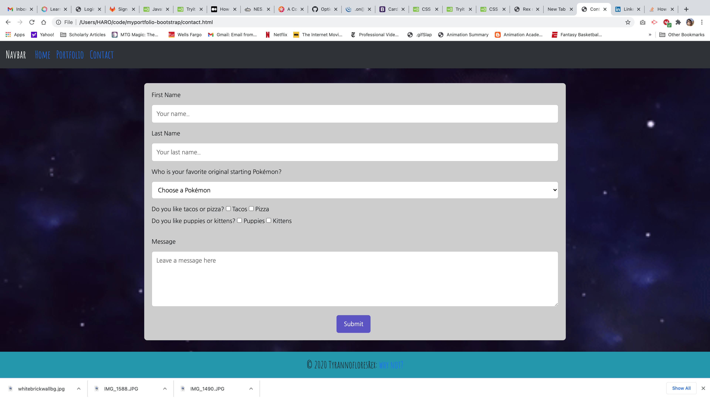

# myportfolio-bootstrap

This is a basic portfolio built using bootstraps. Elements are nested inside rows and columns and styled with bootstrap/css elements.

THe portfolio pages houses links to other works.

The Contact page has a mockup contact form that is not connected to anything.

the home page has a small about me section and a splash of excitement because of a pseudo-class element on an img.

I am not active on social media and did not include any links

